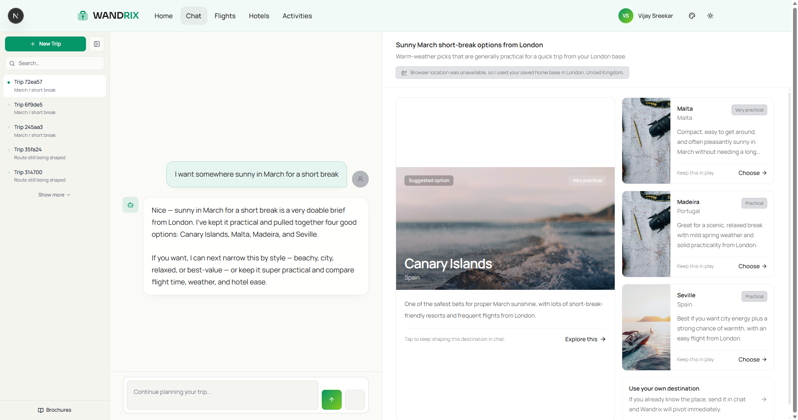
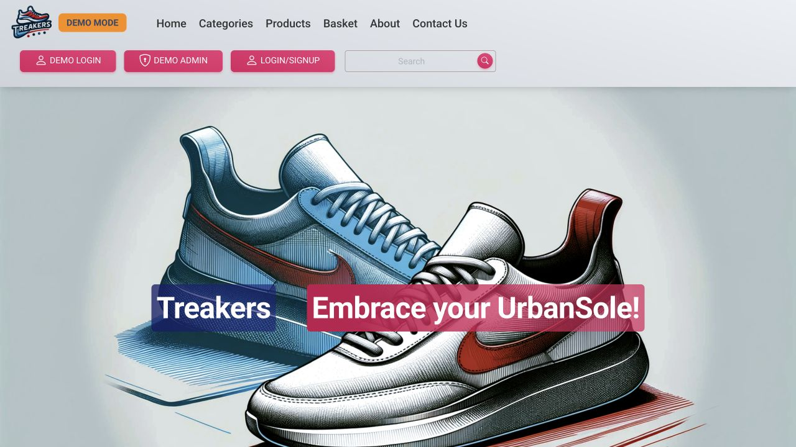
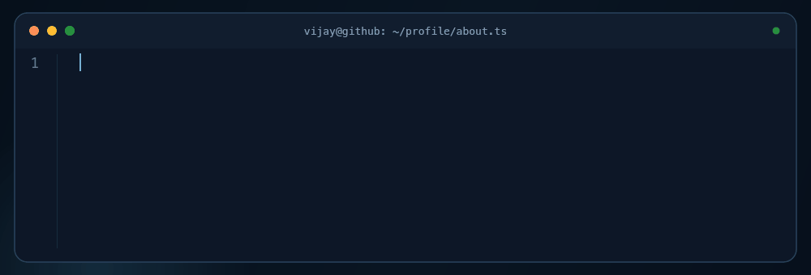
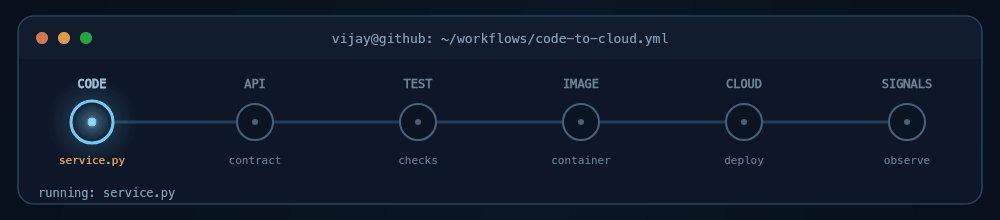

<picture>
  <source media="(prefers-reduced-motion: reduce)" srcset="./assets/london-workspace.png">
  
</picture>

<h1 align="center">Vijay Sreekar</h1>

I build backend services and product interfaces with Python and TypeScript.

  
  
  

  <a href="#selected-work">Projects</a> · <a href="#open-source-contributions">Open source</a> · <a href="#engineering-stack">Stack</a>

**Currently building:** Wandrix, a travel planner, and **AI ERP**, an enterprise resource planning project with an AI focus. Both are in development.

## Selected work

<table>
<tr>
<td width="30%" valign="middle">

Earlier development capture
</td>
<td width="70%" valign="top">
<h3>Wandrix</h3>

Travel conversations, an editable trip board, and saved brochures.

Python · FastAPI · Next.js · PostgreSQL

<a href="https://github.com/VijaySreekar/Wandrix-Live">Code & architecture</a> · <a href="https://www.wandrix.app/">Website</a>
</td>
</tr>
<tr>
<td width="30%" valign="middle">

Fictional sample data
</td>
<td width="70%" valign="top">
<h3>Spotify Insights</h3>

Explore listening history through artist, track, and time-of-day analysis. Built with <a href="https://github.com/GanapathiThota">GanapathiThota</a>.

Python · pandas · Streamlit

<a href="https://github.com/VijaySreekar/StreamLitSpotifyInsights">Code & setup</a>
</td>
</tr>
<tr>
<td width="30%" valign="middle">

Live demo
</td>
<td width="70%" valign="top">
<h3>Treakers</h3>

Sneaker storefront and admin dashboard. An Aston University project built by Team 27.

PHP · SQLite · Bootstrap

<a href="https://github.com/VijaySreekar/treakers-demo">Code & screenshots</a> · <a href="https://treakers-demo.vercel.app/">Demo</a>
</td>
</tr>
</table>

[**Browse all projects →**](./PROJECTS.md) — includes Alarm App, original team repositories, and coursework.

## Open-source contributions

Selected public contributions will be added here.

| Project | Contribution | PR / issue |
| :--- | :--- | :--- |
| *Coming soon* | — | — |

<!-- Placeholder only. Replace with verified public contributions and direct PR/issue links. -->

## GitHub snapshot

  

  
  

Generated from public GitHub activity; updates depend on the card service.

## A little about me

  <picture>
    <source media="(prefers-reduced-motion: reduce)" srcset="./assets/about-code-static.png">
    
  </picture>

## Engineering stack

APIs and backend services · Relational data · Web interfaces

Python, TypeScript, FastAPI, PostgreSQL, React, Next.js, Docker, and GitHub Actions.

<strong>CORE SYSTEMS</strong>

  
  
  
  
  
  

<strong>CLOUD &amp; DELIVERY</strong>

  
  
  
  
  
  

<strong>PRODUCT &amp; AI</strong>

  
  
  
  
  
  

## Code to cloud

I care about the full delivery path around a backend service: explicit contracts, automated checks, reproducible containers, controlled deployment, and useful signals after release.

  <picture>
    <source media="(prefers-reduced-motion: reduce)" srcset="./assets/code-to-cloud-static.png">
    
  </picture>

---

<a href="https://github.com/VijaySreekar?tab=repositories">Explore my repositories</a> · <a href="https://github.com/VijaySreekar?tab=followers">Follow my work</a>

<picture>
  
</picture>
