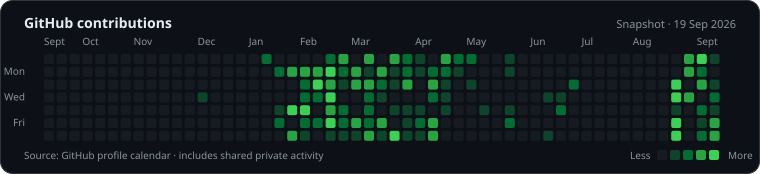

<picture>
  <source media="(prefers-reduced-motion: reduce)" srcset="./assets/london-workspace.png">
  
</picture>

## Thoughtful software, end to end

I build backend services and product interfaces with a focus on clear contracts, useful tests, and software people can depend on.

[Projects](#featured-projects) · [Open source](#open-source) · [Skills](#skills) · [Contributions](#js-contribution-activity-description) · [LinkedIn](https://www.linkedin.com/in/vijay-sreekar-kakarapalli/)

## Featured projects

<table width="100%">
<tr><td>
<h3><a href="https://orbit-erp-psi.vercel.app/">Orbit ERP</a></h3>

A live portfolio edition of a modular business system I developed with Manikata Tej. Explore editable fictional records across sales, inventory, finance, payroll and projects using <strong>Demo login</strong>. The source is private, and this demo is separate from the original business system.

<strong>Next.js · FastAPI · PostgreSQL</strong>

<a href="https://orbit-erp-psi.vercel.app/">Explore the live demo</a>

</td></tr>
</table>

<table width="100%">
<tr><td>
<h3><a href="https://www.wandrix.app/">Wandrix</a></h3>

An AI travel planner with a conversation beside an editable trip board. Save trips across sessions, create brochure snapshots and export PDFs.

<strong>Next.js · FastAPI · PostgreSQL · LangGraph</strong>

<a href="https://www.wandrix.app/">Visit Wandrix</a> · <a href="https://github.com/VijaySreekar/Wandrix-Live">Explore the code</a>

</td></tr>
</table>

## More projects

- **[Spotify Insights](https://github.com/VijaySreekar/StreamLitSpotifyInsights)** — A Streamlit app co-built with [GanapathiThota](https://github.com/GanapathiThota) to explore uploaded listening-history exports by artist, track, day and hour. Includes fictional sample data.
- **[Treakers](https://github.com/VijaySreekar/treakers-demo)** — A Team 27 university sneaker storefront and admin dashboard built with PHP. The [live demo](https://treakers-demo.vercel.app/) uses seeded SQLite data.
- **[Alarm App](https://github.com/VijaySreekar/AlarmApp)** — A React Native/Expo prototype with saved alarms, local notifications and a five-minute snooze.
- **AI ERP (in progress)** — A separate private enterprise-platform project. Its AI capabilities are planned, not presented here as shipped.

[See the full project index](./PROJECTS.md)

## Open source

<table width="100%">
<thead><tr><th align="left">Repository</th><th align="left">Pull requests</th></tr></thead>
<tbody>
<tr>
<td valign="top"><a href="https://github.com/doobidoo/mcp-memory-service">MCP Memory Service</a></td>
<td valign="top"><a href="https://github.com/doobidoo/mcp-memory-service/pull/1267">Quality scoring #1267</a>  <a href="https://github.com/doobidoo/mcp-memory-service/pull/1232">Safer maintenance scripts #1232</a>  <a href="https://github.com/doobidoo/mcp-memory-service/pull/1219">Safe process stopping #1219</a></td>
</tr>
<tr>
<td valign="top"><a href="https://github.com/zulip/zulip">Zulip</a></td>
<td valign="top"><a href="https://github.com/zulip/zulip/pull/40124">Emoji-picker arrow styling #40124</a></td>
</tr>
</tbody>
</table>

[Browse all authored pull requests](https://github.com/search?q=is%3Apr+author%3AVijaySreekar&type=pullrequests)

## Skills

**Languages**

  
  
  
  
  
  
  

**Frontend and product**

  
  
  
  
  
  
  

**APIs and data**

  
  
  
  
  
  
  
  

**AI and identity**

  
  
  
  
  
  

**Cloud and delivery**

  
  
  
  
  
  
  
  

Also used Go in the PulseCheck personal project and Java in university coursework. Practical delivery includes unit and integration testing, CI/CD, peer review and Scrum.

## Contribution activity

Snapshot captured 19 September 2026 from GitHub’s contribution calendar. The live calendar appears below my pinned repositories.
